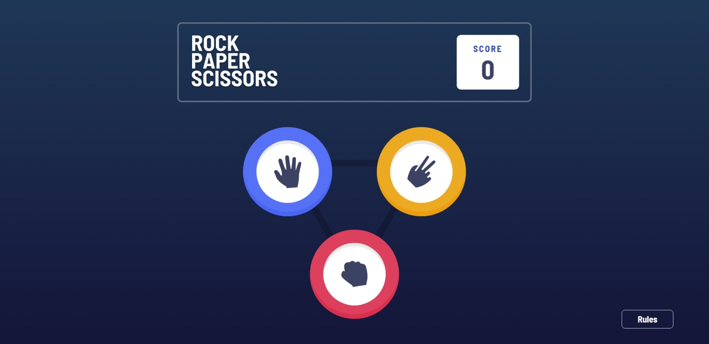
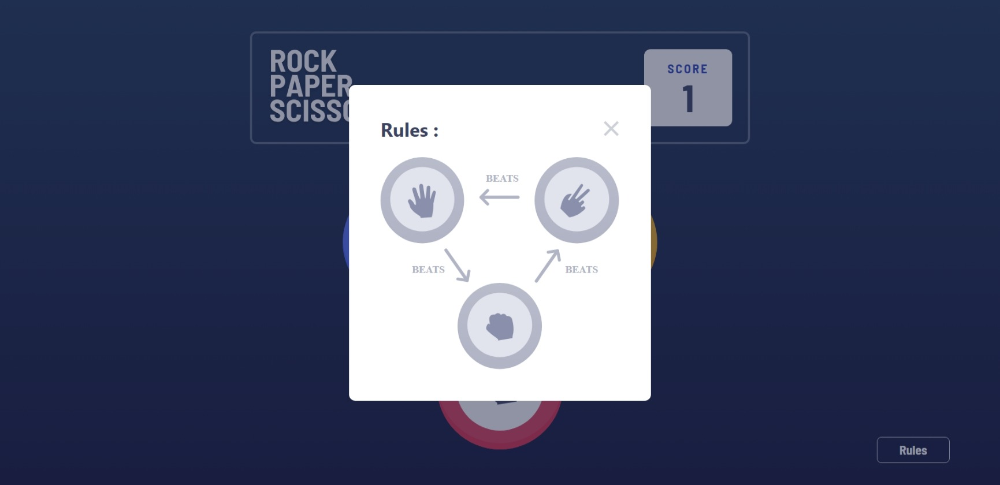
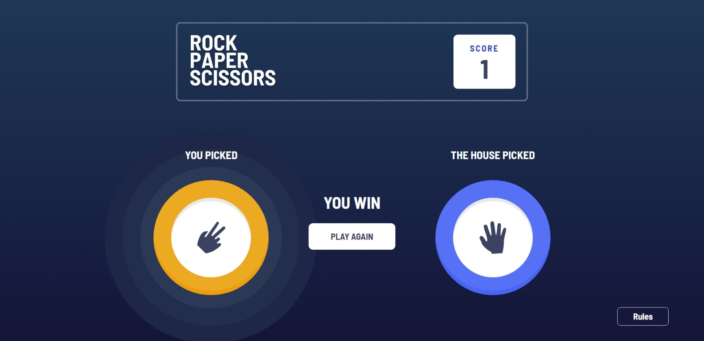
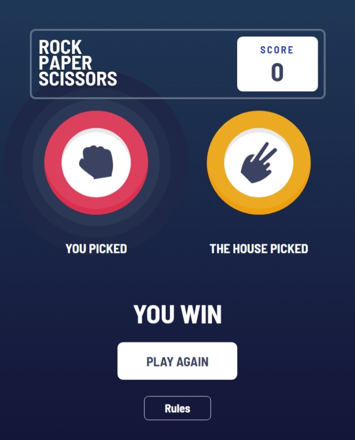

# Frontend Mentor - Rock, Paper, Scissors solution

This is a solution to the [Rock, Paper, Scissors challenge on Frontend Mentor](https://www.frontendmentor.io/challenges/rock-paper-scissors-game-pTgwgvgH). Frontend Mentor challenges help you improve your coding skills by building realistic projects. 

## Table of contents

- [Overview](#overview)
  - [The challenge](#the-challenge)
  - [Screenshot](#screenshot)
  - [Links](#links)
- [My process](#my-process)
  - [Built with](#built-with)
  - [What I learned](#what-i-learned)
  - [Continued development](#continued-development)

## Overview

### The challenge

Users should be able to:

- View the optimal layout for the game depending on their device's screen size
- Play Rock, Paper, Scissors against the computer
- Maintain the state of the score after refreshing the browser 

### Screenshot

### Links

- Live Site URL: [Rock-Paper-Scissors](https://rock-paper-scissors-five-lemon.vercel.app/)

## My process

### Built with

- Semantic HTML5 markup
- CSS custom properties
- Flexbox
- [React](https://reactjs.org/) - JS library
- [Tailwindcss](https://tailwindcss.com/) - For styles

### What I learned

This was very fun project to do as this game was one of the best games for me when I was a child. This game was the judge of every discussion and ... for us growing up. I started learning framer-motion library while doing my last project and now I am better. I used it to do ease motions for the items in the app.

### Continued development

In the future I will make the option to play : Rock, Paper, Scissors, Lizard, Spock

